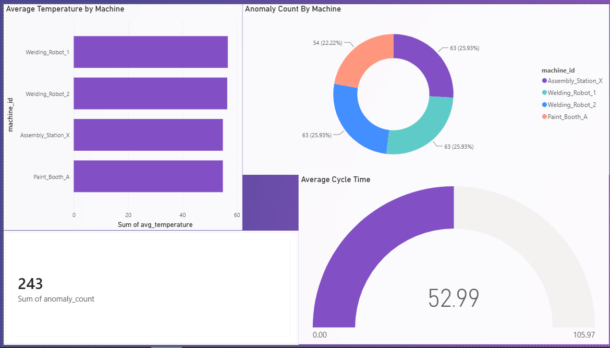

# Automotive IoT Manufacturing Analytics

This project simulates an automotive assembly line and builds a comprehensive data pipeline using Python, Databricks (PySpark), and Power BI. It demonstrates the ability to ingest, process, and visualize manufacturing IoT data at scale to improve plant throughput and monitor equipment health.

### Architecture Overview

1. **IoT Data Generator (`data_generator.py`)**: Simulates sensor readings (temperature, vibration, cycle time) from robotic welders and paint booths.
2. **Databricks Pipeline (`databricks_pipeline.py`)**: Implements a Medallion architecture (Bronze -> Silver -> Gold) using PySpark to clean data, identify anomalies, and aggregate KPIs.
3. **Power BI Dashboard**: Visualizes the `Gold` data layer to monitor plant throughput and equipment health.

### Step 1: Generate the Raw Data
Run the python script to generate simulated IoT data. This will create a `data/raw/assembly_line_iot_data.csv` file.

```bash
python data_generator.py
```

### Step 2: Process the Data (Databricks)
**Option A: Local execution (Requires PySpark and Java)**
You can run the pipeline locally if you have Java and `pyspark` installed.
```bash
pip install pyspark
python databricks_pipeline.py
```

**Option B: Local execution (Easy mode with Pandas)**
If you don't have PySpark and Java installed, I've provided a simple pandas script to immediately generate the exact same `gold` datasets so you can build the Power BI dashboard right away.
```bash
python local_data_processor.py
```

**Option C: Databricks Community Edition (Recommended for Interview)**
1. Sign up for a free Databricks Community Edition account.
2. Create a cluster.
3. Upload `assembly_line_iot_data.csv` to the Databricks File System (DBFS).
4. Create a new Notebook, paste the code from `databricks_pipeline.py`, update `RAW_DATA_PATH` to the DBFS path, and run the notebook.

*(If you ran it locally, the processed data will be saved in `data/gold/kpi_metrics/`)*

### Step 3: Build the Power BI Dashboard
1. Open Power BI Desktop.
2. Click **Get Data** -> **Text/CSV**.
3. Import the generated CSV file from the `data/gold/kpi_metrics/` directory.
4. **Create the following Visuals:**
   - **Card**: Total Anomalies (sum of `anomaly_count`)
   - **Clustered Bar Chart**: Average Temperature by Machine (`machine_id` on X, `avg_temperature` on Y)
   - **Donut Chart**: Proportion of Anomalies by Machine
   - **Gauge Chart**: Average Cycle Time (to measure throughput efficiency)
5. **Aesthetics**: Use a sleek dark mode theme or a clean corporate branding to make the dashboard look professional and premium.

## Final Dashboard

